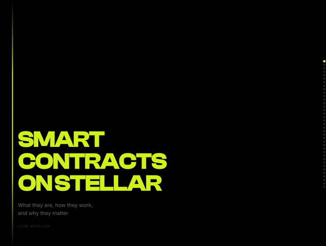

# Smart Contracts on Stellar

A presentation explaining smart contracts on Stellar — what they are, how they work, and why they matter.

## About

- **Format:** 30 minute talk with 15 minute Q&A
- **Level:** High level, non-developer audience
- **Style:** Lecture style

## Topics Covered

- **Vending machines as a metaphor** — self-enforcing rules, no middleman
- **Nick Szabo and the origin of smart contracts** — the term predates Bitcoin by over a decade
- **What a smart contract is** — an agreement in code, running on a network nobody owns
- **How to use a smart contract** — identify, simulate, submit, execute
- **Stellar and Soroban** — how Stellar went from 26 fixed operations to unlimited programmable contracts
- **Lifecycle of smart contract development** — write, audit, compile, upload, deploy, use
- **Building blocks** — logic, storage, auth, events, cross-contract calls
- **How a contract works internally** — inputs, outputs, state, events
- **SDF's mission** — equitable access to the global financial system
- **Financial services smart contracts unlock** — tokens, swaps, lending, liquidity, payments, and more
- **Real examples on Stellar** — Blend, Soroswap, Sushi, Reflector, Axelar, FxDAO, Soroban Domains, Kale, DeFindex, and others

## Running

Open `presentation.html` in a browser.

- Arrow keys or Space to navigate
- Cmd/Ctrl+P to pop out speaker notes to a separate window
- Speaker notes are shown inline at the top by default

## Exporting

Two export buttons are available in the bottom-right corner of the presentation:

- **Export PDF** — slides only, 16:10 custom page size
- **PDF + Notes** — A4 portrait, each slide with speaker notes below
